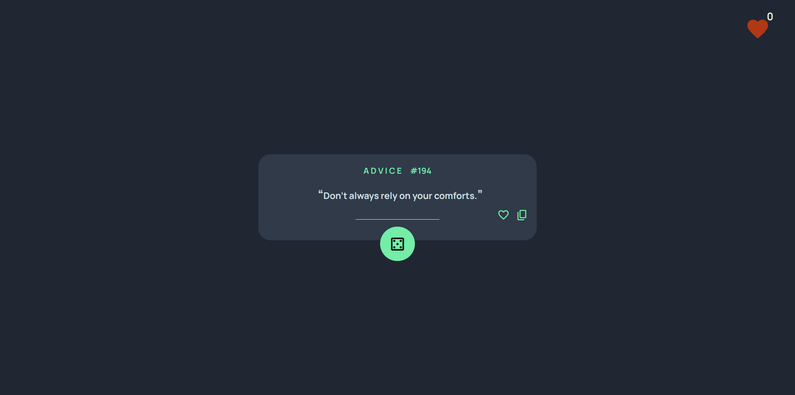
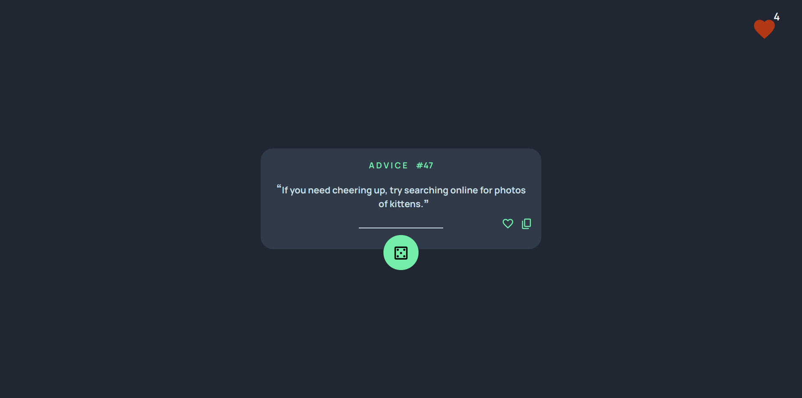
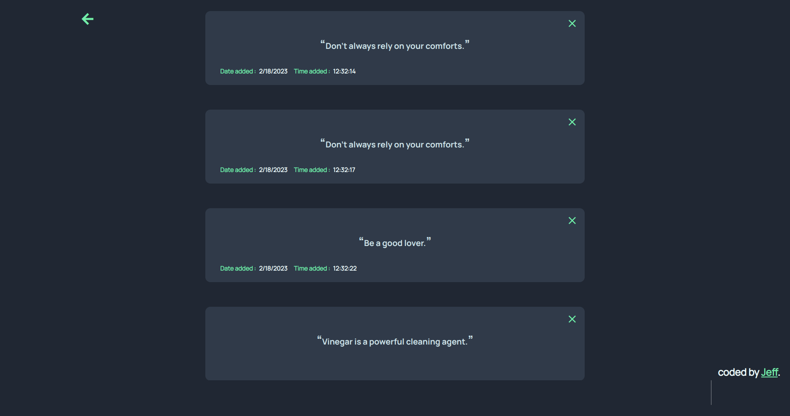
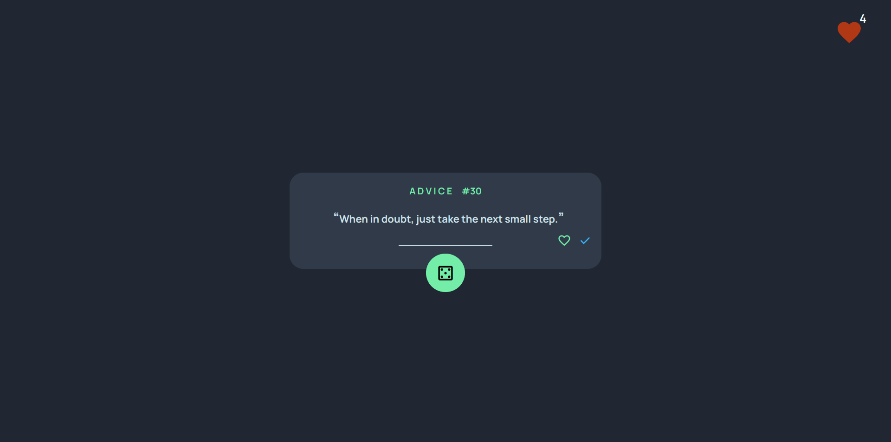

# Advice Generator
This is a web application that generates random pieces of advice based on user preferences. The advice generator is built using React and uses a third-party API to retrieve advice data.

## Installation
To install this project on your local machine, follow these steps:
 
- Clone the repository to your local machine using Git.
- Navigate to the project directory.
- To install the necessary dependencies run :-

        npm install 
- To start the application run :-

        npm run start 

## Screenshots

## Live link

- <a href="https://advice-generator-weld.vercel.app/">Advice generator</a>

## Technologies used

- HTML
- Javascript
- React
- API ( <a href="https://api.adviceslip.com/advice">Advice Slip API</a> )
- Vercel ( deployment )
- Mock db.json server for storing user's liked advice.

## Features

- Generate random pieces of advice.
- Like advice.
- Save advice.
- Delete advice.
- Copy advice to you clipboard.
- User's liked pieces of advice are stored in a deployed db.json file hence persist.
- Check the number of liked pieces of advice one has.

## Usage
To use the advice generator, follow these steps:

- Click the "Dice Icon" button to generate a random piece of advice.
- If you like the advice, you can save it by clicking the "heart-shaped" icon.
- If you want to generate a new piece of advice, click the "Dice Icon" button.
- To check your liked recommendations click the heart-shaped icon.
- To delete a piece of advice click the cancel icon.

## Contributing
If you would like to contribute to this project, please follow these steps:

- Fork the repository.
- Create a new branch for your changes.
- Make your changes and commit them.
- Push your changes to your fork.
- Submit a pull request.

# Credits
This project was built using React and the Advice Slip API. Thanks to the developers of these tools for making this project possible.

# Author
 This project was developed by;

 Jeff Maina

# License
This project is licensed under the MIT License. Feel free to use and modify this code as you see fit.